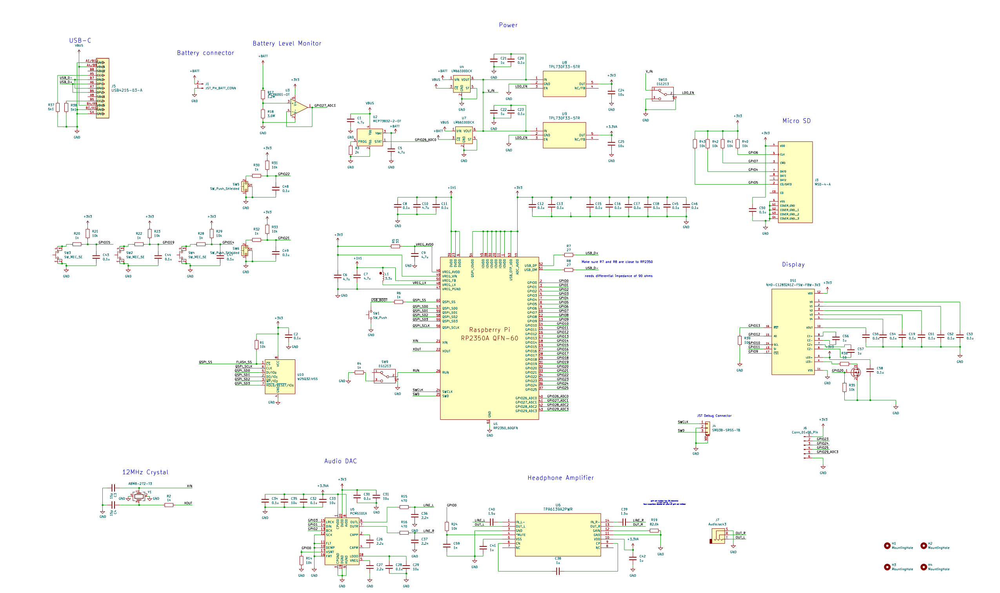
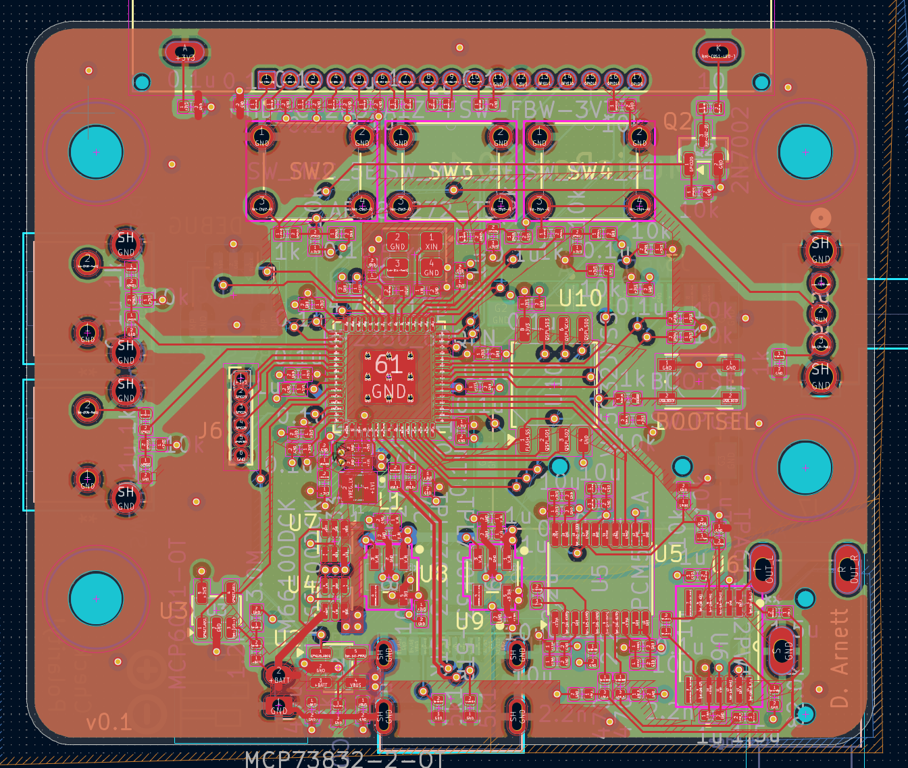
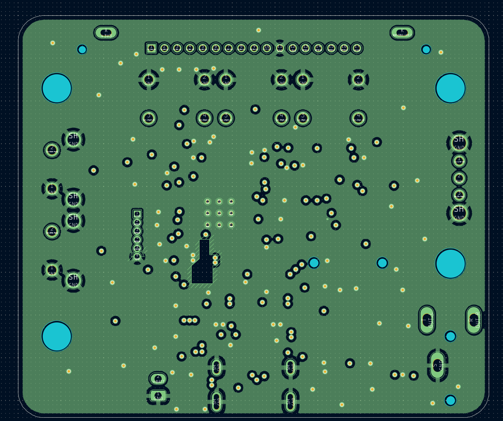
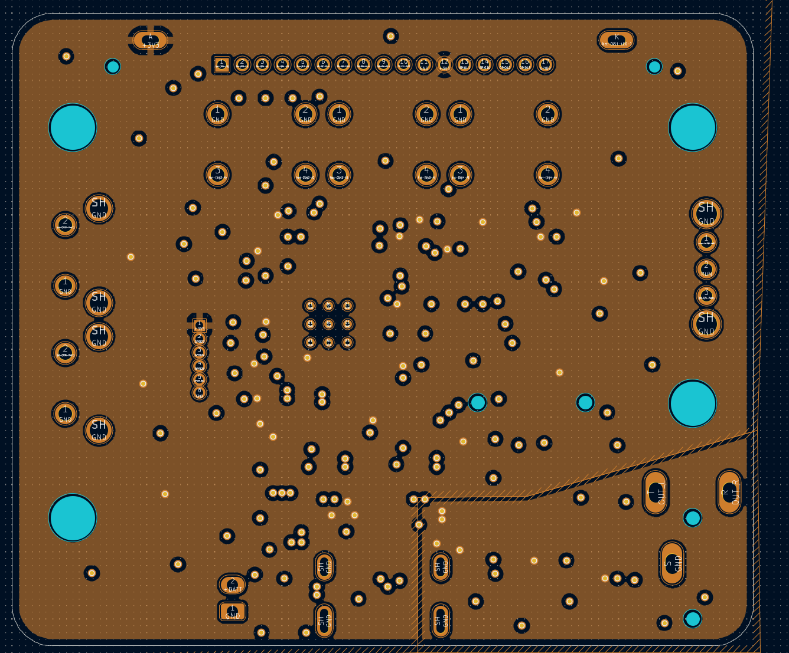
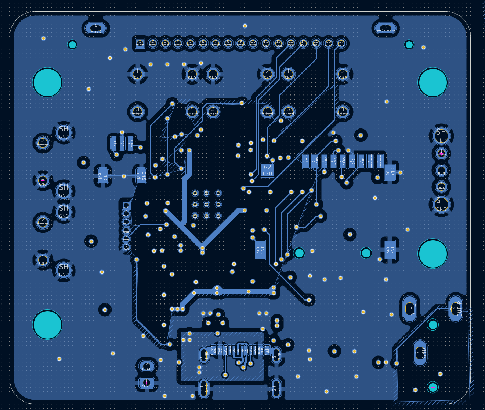
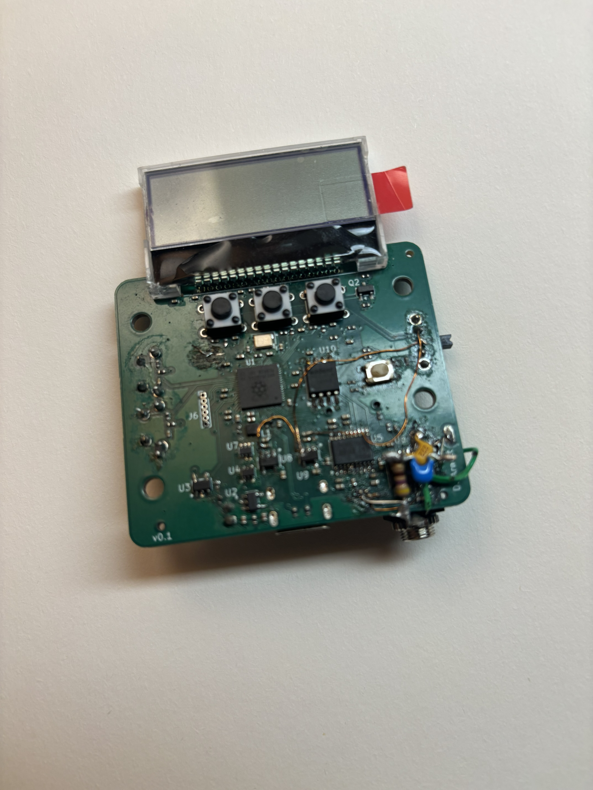
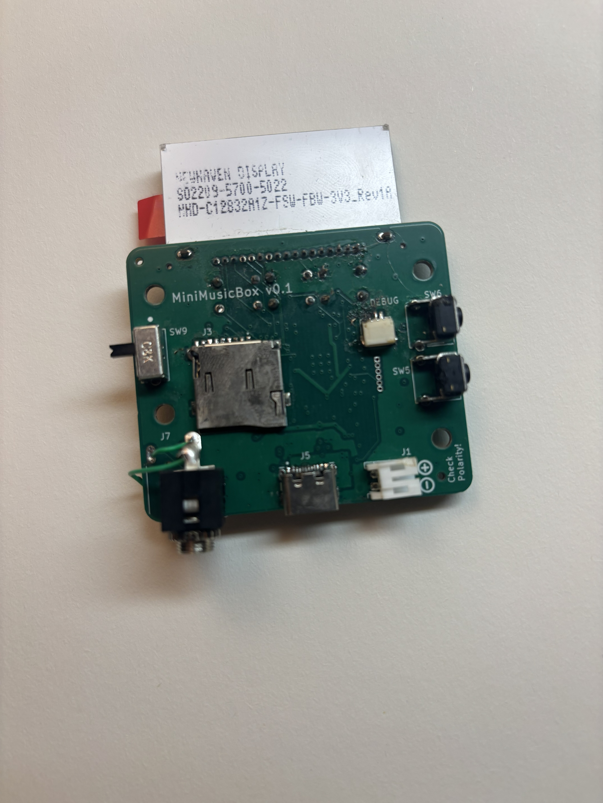

# MiniMusicBox

An open source, RP2350 based MP3 player, with LiPo battery charging, USB-C, MicroSD storage, high fidelity analog audio, and a black & white LCD screen.

Although this version of the project will work, I would not recommend building it, as it has a design flaw leading to high idle battery consumption. This will be fixed in a future revision.

This board was designed with the manufacturing tolerances of [JLCPCB](https://jlcpcb.com/) in mind.

